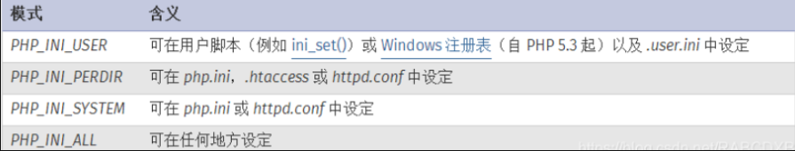
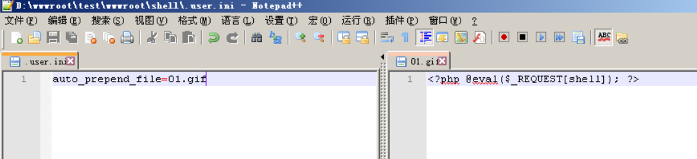

# 伪协议

```php
?file=php://filter/read=convert.base64-encode/resource=flag.php
```

php://filter与包含函数结合时，php://filter流会被当作php文件执行。所以我们一般对其进行编码，阻止其不执行。从而导致任意文件读取。

php://filter 伪协议文件包含读取源代码，加上read=convert.base64-encode，用base64编码输出，不然会直接当做php代码执行，看不到源代码内容。

--------------

# .user.ini与.htaccess

user.ini。它比.htaccess用的更广，不管是nginx/apache/IIS，只要是以fastcgi运行的php都可以用这个方法。可谓很广，不像.htaccess有局限性，只能是apache.

什么是.user.ini？

这得从php.ini说起了，php.ini是php的默认配置文件，这些配置中，分为几种：



除了主 php.ini 之外，PHP 还会在每个目录下扫描 INI 文件，从被执行的 PHP 文件所在目录开始一直上升到 web 根目录（`$_SERVER['DOCUMENT_ROOT']` 所指定的）。如果被执行的 PHP 文件在 web 根目录之外，则只扫描该目录。

在 `.user.ini` 风格的 INI 文件中只有具有 PHP_INI_PERDIR 和 PHP_INI_USER 模式的 INI 设置可被识别。

>    `.user.ini`是一个能被动态加载的ini文件。也就是说我修改了`.user.ini`后，不需要重启服务器中间件，只需要等待`user_ini.cache_ttl`所设置的时间（默认为300秒），即可被重新加载。

要用到的配置：`auto_append_file`:指定一个文件，自动包含在要执行的文件前，类似于在文件前调用了require()函数。而auto_append_file类似，只是在文件后面包含。 使用方法很简单，直接写在.user.ini中：

```
auto_prepend_file=01.gif
```



关于.user.ini的文章：

[https://wooyun.js.org/drops/user.ini%E6%96%87%E4%BB%B6%E6%9E%84%E6%88%90%E7%9A%84PHP%E5%90%8E%E9%97%A8.html](https://wooyun.js.org/drops/user.ini文件构成的PHP后门.html)

# .htaccess

上传.htaccess，有几种写法：

>   SetHandler application/x-httpd-php

```
<FilesMatch "bbb">
SetHandler application/x-httpd-php
</FilesMatch>
//其中bbb是要包含的文件，都会被当做php来执行
```

>   ```
>   AddType application/x-httpd-php .png
>   ```

大致就上面3种写法吧。

